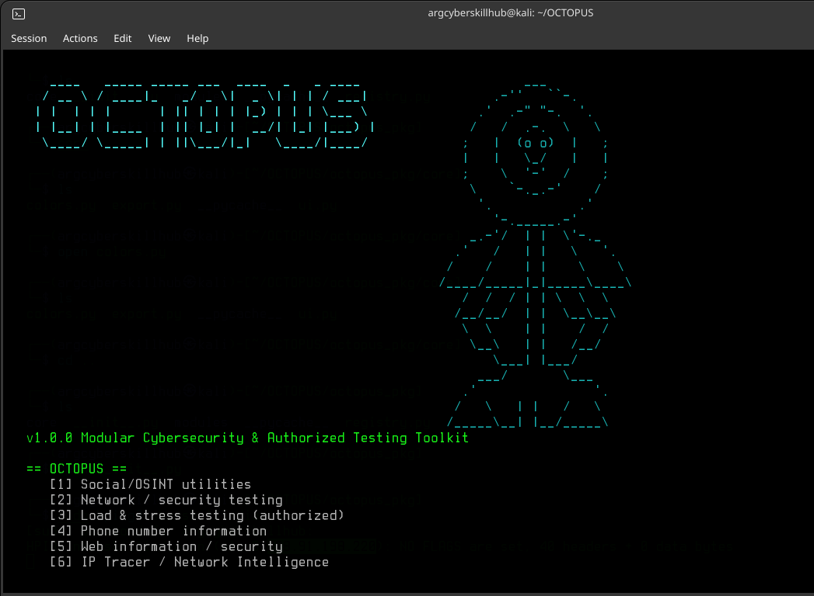

OCTOPUS 🐙

Modular CLI Cybersecurity & Authorized Security-Testing Toolkit

OCTOPUS is a modular command-line toolkit designed for cybersecurity research, reconnaissance, OSINT, network analysis, and authorized security testing. It brings multiple security utilities together under a single interactive CLI.

⚠️ Authorized Use Only: OCTOPUS is intended only for systems, networks, domains, IP addresses, and other assets that you own or have explicit permission to test.

✨ Features

🔎 OSINT

Public phone-number information
IP address intelligence
Network information
Public web information
No authentication bypass or private-data access

🌐 Network Reconnaissance

Authorized target discovery
Basic network/service information
Explicit authorization confirmation before scans

📊 Controlled Load Testing

Safety-limited testing
Hard request/rate caps
Designed for authorized environments
No DDoS, amplification, spoofing, or botnet functionality

🧩 Modular Architecture

CLI-based interface
Separate modules for different security tasks
Easy to extend with additional authorized-testing modules
🛡️ Safety Model

OCTOPUS follows a safety-first approach:

All testing must be performed against authorized targets only.
OSINT functionality is limited to publicly accessible information.
Network scanning requires explicit authorization confirmation for the target.
Load-testing functionality includes hard safety limits.
The [6] DDoS menu option does not perform a real DDoS attack.
No botnets, spoofing, amplification attacks, credential theft, or authentication bypass functionality is included.
📦 Requirements
Python 3.x
Linux / Kali Linux recommended
pip
Internet connection for modules that query public services
🚀 Installation

Clone the repository:

git clone https://github.com/cybergana-web/OCTOPUS.git
cd OCTOPUS

Create a virtual environment:

python3 -m venv venv
source venv/bin/activate

Install dependencies:

pip install -r requirements.txt

▶️ Usage

Start OCTOPUS with:

python3 octopus.py

Follow the interactive CLI menu and select the module you want to use.

📁 Project Structure
OCTOPUS/
├── octopus.py
├── requirements.txt
├── README.txt
├── modules/
│   ├── osint/
│   ├── network/
│   └── loadtest/
└── ...

## 🐙 OCTOPUS

  

The exact structure may change as the project develops.

🎯 Intended Use

OCTOPUS can be used for:

Cybersecurity education
OSINT research
Authorized reconnaissance
Security lab environments
Network analysis
Authorized load/stress testing
CTF and controlled research environments
⚠️ Disclaimer

The author is not responsible for misuse of this software.

By using OCTOPUS, you agree to use it only against systems and targets for which you have explicit authorization. Unauthorized scanning, disruption, data collection, or other malicious activity may violate applicable laws and regulations.

Use responsibly. Stay authorized. 🐙
